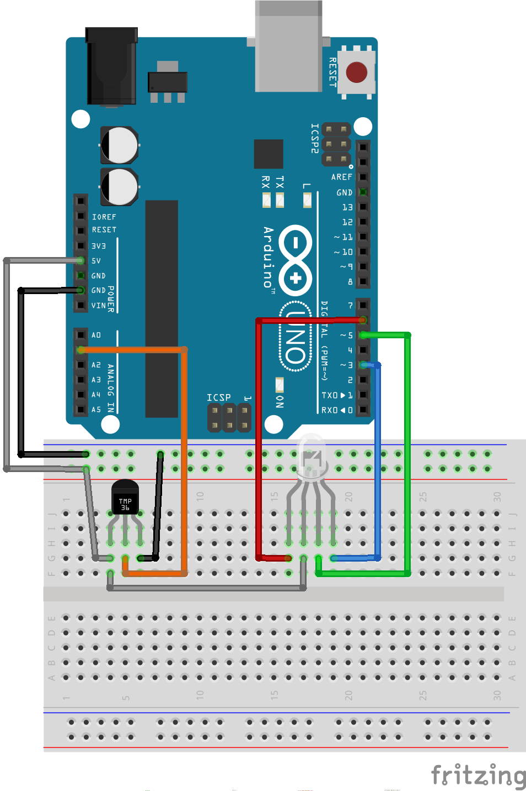
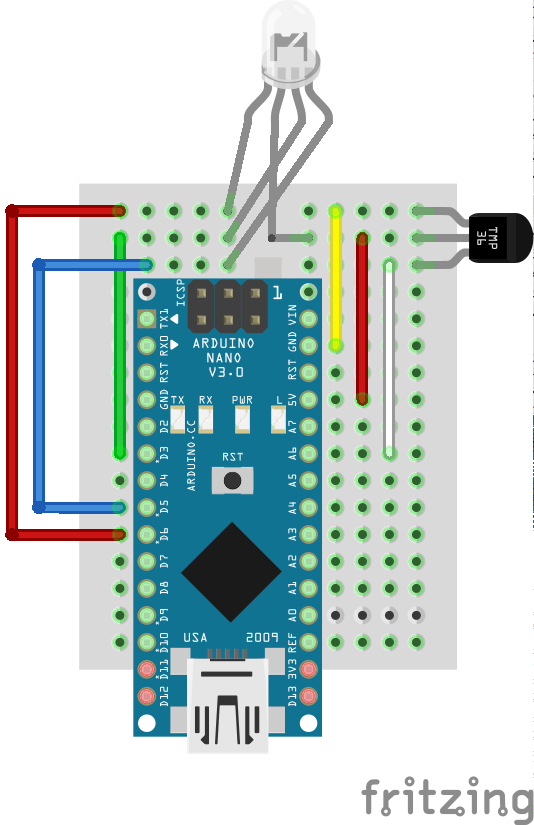

# Temperature Monitoring Demo

Demo application to showcase the use of node and Arduino devices.

## Preparing the Hardware

1. In your favorite Arduino IDE, load the `StandardFirmata` sketch into your board. Usualy this sketch can be found in the Examples area.

2. Assemble your board as described in the diagram bellow:

### Arduino Uno:



### Arduino Nano:



## Running the demo

1. Install the dependencies:

```
$ npm install
```

3. Criate your `config.js`. You can use the template available on `config.js.dist`:

```
$ cp config.js.dist config.js
$ vi config.js
```

4. Start the app:

```
$ node app.js
```
